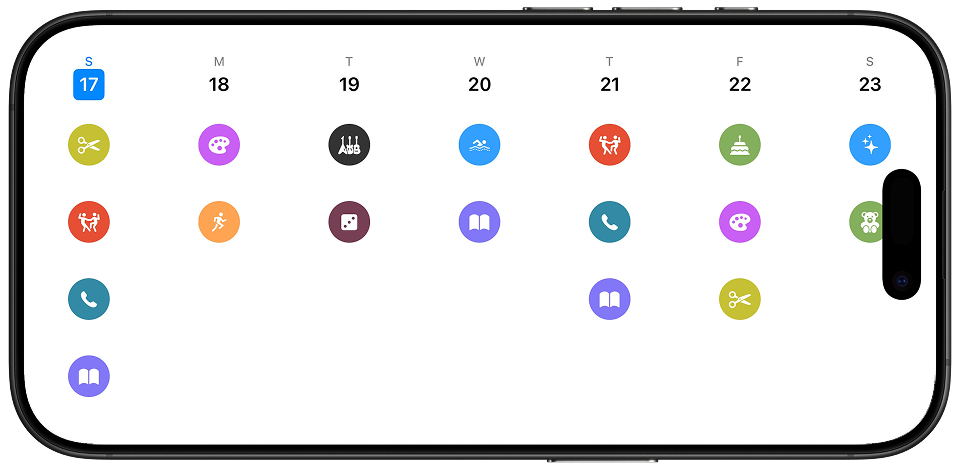
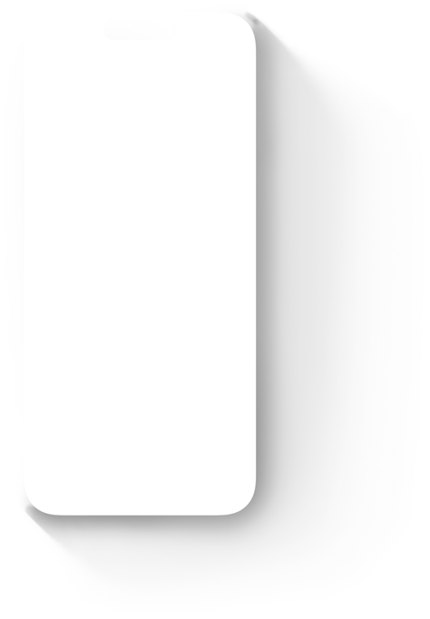
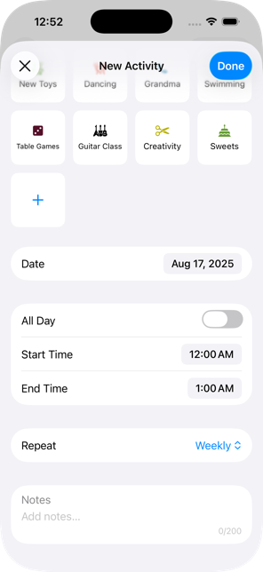
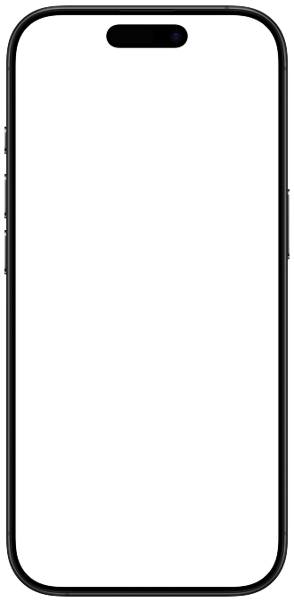
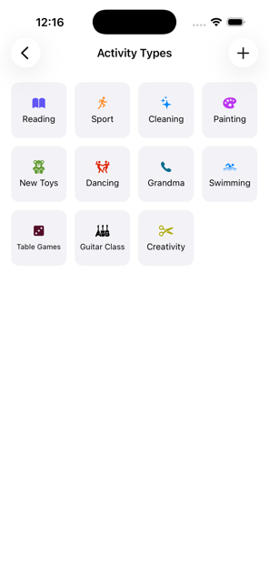
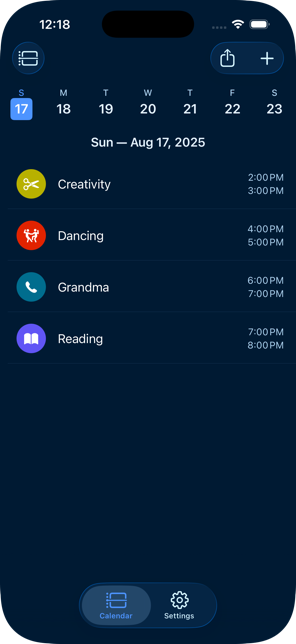
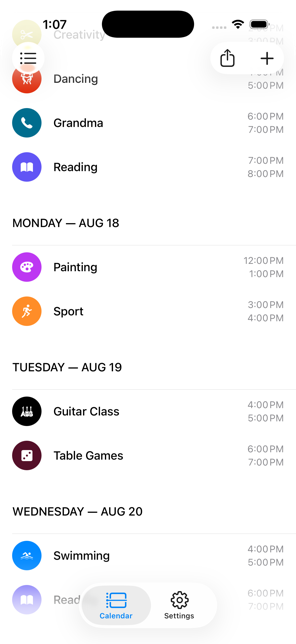
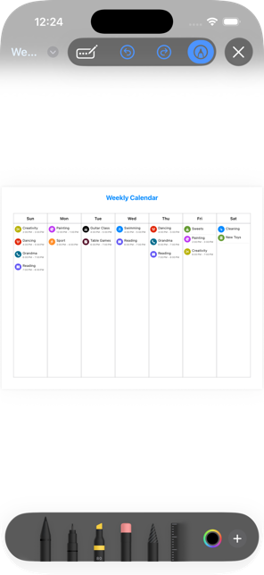
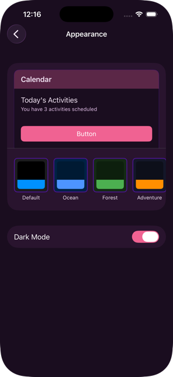

<section class="hero">
    

        
        <h3 class="app-name">Weeka</h3>
        <h1>Family life. Organized visually.</h1>
        
Turn daily negotiations into visual agreements. Weeka brings the proven kindergarten planning system to your home.

        <a href="https://apps.apple.com" class="btn btn-primary">
            <svg width="20" height="20" viewBox="0 0 24 24" fill="currentColor">
                <path d="M18.71 19.5c-.83 1.24-1.71 2.45-3.05 2.47-1.34.03-1.77-.79-3.29-.79-1.53 0-2 .77-3.27.82-1.31.05-2.3-1.32-3.14-2.53C4.25 17 2.94 12.45 4.7 9.39c.87-1.52 2.43-2.48 4.12-2.51 1.28-.02 2.5.87 3.29.87.78 0 2.26-1.07 3.81-.91.65.03 2.47.26 3.64 1.98-.09.06-2.17 1.28-2.15 3.81.03 3.02 2.65 4.03 2.68 4.04-.03.07-.42 1.44-1.38 2.83M13 3.5c.73-.83 1.94-1.46 2.94-1.5.13 1.17-.34 2.35-1.04 3.19-.69.85-1.83 1.51-2.95 1.42-.15-1.15.41-2.35 1.05-3.11z"/>
            </svg>
            Open the app
        </a>
    

    

        

            <picture class="hero-shadow">
                <source srcset="Images/hero/hero_img_shadow_small.png, Images/hero/hero_img_shadow_small@2x.png 2x" media="(max-width:734px)">
                <source srcset="Images/hero/hero_img_shadow_medium.png, Images/hero/hero_img_shadow_medium@2x.png 2x" media="(max-width:1068px)">
                <source srcset="Images/hero/hero_img_shadow_large.png, Images/hero/hero_img_shadow_large@2x.png 2x" media="(min-width:0px)">
                
            </picture>
            <picture class="hero-device">
                <source srcset="Images/hero/hero_img_small.png, Images/hero/hero_img_small@2x.png 2x" media="(max-width:734px)">
                <source srcset="Images/hero/hero_img_medium.png, Images/hero/hero_img_medium@2x.png 2x" media="(max-width:1068px)">
                <source srcset="Images/hero/hero_img_large.png, Images/hero/hero_img_large@2x.png 2x" media="(min-width:0px)">
                
            </picture>
        

    

</section>

<section class="features" id="features">
    

        

            

                <h2>Create activities in seconds</h2>
                
Add new activities with just a few taps. Choose from dozens of colorful icons, set the schedule, and you're done. Perfect for adding guitar lessons, playdates, or that weekly ice cream treat.

            

            

                

                        <picture class="iphone-shadow">
                            <source srcset="Images/bezels/shadow_small.png, Images/bezels/shadow_small@2x.png 2x" media="(max-width:734px)">
                            <source srcset="Images/bezels/shadow_medium.png, Images/bezels/shadow_medium@2x.png 2x" media="(max-width:1068px)">
                            <source srcset="Images/bezels/shadow_large.png, Images/bezels/shadow_large@2x.png 2x" media="(min-width:0px)">
                            
                        </picture>
                        <picture class="iphone-screen">
                            <source srcset="Images/features/new_activity_small.png, Images/features/new_activity_small@2x.png 2x" media="(max-width:734px)">
                            <source srcset="Images/features/new_activity_medium.png, Images/features/new_activity_medium@2x.png 2x" media="(max-width:1068px)">
                            <source srcset="Images/features/new_activity_large.png, Images/features/new_activity_large@2x.png 2x" media="(min-width:0px)">
                            
                        </picture>
                        <picture class="iphone-hardware">
                            <source srcset="Images/bezels/bezel_small.png, Images/bezels/bezel_small@2x.png 2x" media="(max-width:734px)">
                            <source srcset="Images/bezels/bezel_medium.png, Images/bezels/bezel_medium@2x.png 2x" media="(max-width:1068px)">
                            <source srcset="Images/bezels/bezel_large.png, Images/bezels/bezel_large@2x.png 2x" media="(min-width:0px)">
                            
                        </picture>
                

            

        

        

            

                <h2>Visual clarity for everyone</h2>
                
Kids can't read yet? No problem. Colorful icons make activities instantly recognizable. Sleep, sports, treats, screen time - everything has its own visual identity.

            

            

                

                        <picture class="iphone-shadow">
                            <source srcset="Images/bezels/shadow_small.png, Images/bezels/shadow_small@2x.png 2x" media="(max-width:734px)">
                            <source srcset="Images/bezels/shadow_medium.png, Images/bezels/shadow_medium@2x.png 2x" media="(max-width:1068px)">
                            <source srcset="Images/bezels/shadow_large.png, Images/bezels/shadow_large@2x.png 2x" media="(min-width:0px)">
                            
                        </picture>
                        <picture class="iphone-screen">
                            <source srcset="Images/features/my_activities_small.png, Images/features/my_activities_small@2x.png 2x" media="(max-width:734px)">
                            <source srcset="Images/features/my_activities_medium.png, Images/features/my_activities_medium@2x.png 2x" media="(max-width:1068px)">
                            <source srcset="Images/features/my_activities.png, Images/features/my_activities_large@2x.png 2x" media="(min-width:0px)">
                            
                        </picture>
                        <picture class="iphone-hardware">
                            <source srcset="Images/bezels/bezel_small.png, Images/bezels/bezel_small@2x.png 2x" media="(max-width:734px)">
                            <source srcset="Images/bezels/bezel_medium.png, Images/bezels/bezel_medium@2x.png 2x" media="(max-width:1068px)">
                            <source srcset="Images/bezels/bezel_large.png, Images/bezels/bezel_large@2x.png 2x" media="(min-width:0px)">
                            
                        </picture>
                

            

        

        

            

                <h2>View your schedule, your way</h2>
                
Single day view shows today's activities at a glance - perfect for morning check-ins. Switch to list view for a detailed weekly overview. Or simply rotate to landscape to see the entire week spread out beautifully.

            

            

                

                        <picture class="iphone-shadow">
                            <source srcset="Images/bezels/shadow_small.png, Images/bezels/shadow_small@2x.png 2x" media="(max-width:734px)">
                            <source srcset="Images/bezels/shadow_medium.png, Images/bezels/shadow_medium@2x.png 2x" media="(max-width:1068px)">
                            <source srcset="Images/bezels/shadow_large.png, Images/bezels/shadow_large@2x.png 2x" media="(min-width:0px)">
                            
                        </picture>
                        <picture class="iphone-screen">
                            <source srcset="Images/features/single_day_small.png, Images/features/single_day_small@2x.png 2x" media="(max-width:734px)">
                            <source srcset="Images/features/single_day_medium.png, Images/features/single_day_medium@2x.png 2x" media="(max-width:1068px)">
                            <source srcset="Images/features/single_day_large.png, Images/features/single_day_large@2x.png 2x" media="(min-width:0px)">
                            
                        </picture>
                        <picture class="iphone-hardware">
                            <source srcset="Images/bezels/bezel_small.png, Images/bezels/bezel_small@2x.png 2x" media="(max-width:734px)">
                            <source srcset="Images/bezels/bezel_medium.png, Images/bezels/bezel_medium@2x.png 2x" media="(max-width:1068px)">
                            <source srcset="Images/bezels/bezel_large.png, Images/bezels/bezel_large@2x.png 2x" media="(min-width:0px)">
                            
                        </picture>
                

                

                        <picture class="iphone-shadow">
                            <source srcset="Images/bezels/shadow_small.png, Images/bezels/shadow_small@2x.png 2x" media="(max-width:734px)">
                            <source srcset="Images/bezels/shadow_medium.png, Images/bezels/shadow_medium@2x.png 2x" media="(max-width:1068px)">
                            <source srcset="Images/bezels/shadow_large.png, Images/bezels/shadow_large@2x.png 2x" media="(min-width:0px)">
                            
                        </picture>
                        <picture class="iphone-screen">
                            <source srcset="Images/features/list_small.png, Images/features/list_small@2x.png 2x" media="(max-width:734px)">
                            <source srcset="Images/features/list_medium.png, Images/features/list_medium@2x.png 2x" media="(max-width:1068px)">
                            <source srcset="Images/features/list_large.png, Images/features/list_large@2x.png 2x" media="(min-width:0px)">
                            
                        </picture>
                        <picture class="iphone-hardware">
                            <source srcset="Images/bezels/bezel_small.png, Images/bezels/bezel_small@2x.png 2x" media="(max-width:734px)">
                            <source srcset="Images/bezels/bezel_medium.png, Images/bezels/bezel_medium@2x.png 2x" media="(max-width:1068px)">
                            <source srcset="Images/bezels/bezel_large.png, Images/bezels/bezel_large@2x.png 2x" media="(min-width:0px)">
                            
                        </picture>
                

            

        

        

            

                <h2>Print or Share</h2>
                
Beautiful weekly calendars ready for your fridge. Kids love checking their schedule, and you'll love the peace it brings to your home.

            

            

                

                        <picture class="iphone-shadow">
                            <source srcset="Images/bezels/shadow_small.png, Images/bezels/shadow_small@2x.png 2x" media="(max-width:734px)">
                            <source srcset="Images/bezels/shadow_medium.png, Images/bezels/shadow_medium@2x.png 2x" media="(max-width:1068px)">
                            <source srcset="Images/bezels/shadow_large.png, Images/bezels/shadow_large@2x.png 2x" media="(min-width:0px)">
                            
                        </picture>
                        <picture class="iphone-screen">
                            <source srcset="Images/features/print_small.png, Images/features/print_small@2x.png 2x" media="(max-width:734px)">
                            <source srcset="Images/features/print_medium.png, Images/features/print_medium@2x.png 2x" media="(max-width:1068px)">
                            <source srcset="Images/features/print_large.png, Images/features/print_large@2x.png 2x" media="(min-width:0px)">
                            
                        </picture>
                        <picture class="iphone-hardware">
                            <source srcset="Images/bezels/bezel_small.png, Images/bezels/bezel_small@2x.png 2x" media="(max-width:734px)">
                            <source srcset="Images/bezels/bezel_medium.png, Images/bezels/bezel_medium@2x.png 2x" media="(max-width:1068px)">
                            <source srcset="Images/bezels/bezel_large.png, Images/bezels/bezel_large@2x.png 2x" media="(min-width:0px)">
                            
                        </picture>
                

            

        

        

            

                <h2>Themes they'll love</h2>
                
From ocean adventures to forest expeditions, choose themes that spark joy. Dark mode included for those late-night planning sessions.

            

            

                

                        <picture class="iphone-shadow">
                            <source srcset="Images/bezels/shadow_small.png, Images/bezels/shadow_small@2x.png 2x" media="(max-width:734px)">
                            <source srcset="Images/bezels/shadow_medium.png, Images/bezels/shadow_medium@2x.png 2x" media="(max-width:1068px)">
                            <source srcset="Images/bezels/shadow_large.png, Images/bezels/shadow_large@2x.png 2x" media="(min-width:0px)">
                            
                        </picture>
                        <picture class="iphone-screen">
                            <source srcset="Images/features/themes_small.png, Images/features/themes_small@2x.png 2x" media="(max-width:734px)">
                            <source srcset="Images/features/themes_medium.png, Images/features/themes_medium@2x.png 2x" media="(max-width:1068px)">
                            <source srcset="Images/features/themes_large.png, Images/features/themes_large@2x.png 2x" media="(min-width:0px)">
                            
                        </picture>
                        <picture class="iphone-hardware">
                            <source srcset="Images/bezels/bezel_small.png, Images/bezels/bezel_small@2x.png 2x" media="(max-width:734px)">
                            <source srcset="Images/bezels/bezel_medium.png, Images/bezels/bezel_medium@2x.png 2x" media="(max-width:1068px)">
                            <source srcset="Images/bezels/bezel_large.png, Images/bezels/bezel_large@2x.png 2x" media="(min-width:0px)">
                            
                        </picture>
                

            

        

    

</section>

<section class="opensource">
    

        

            

                <svg width="80" height="80" viewBox="0 0 24 24" fill="currentColor">
                    <path d="M12 0c-6.626 0-12 5.373-12 12 0 5.302 3.438 9.8 8.207 11.387.599.111.793-.261.793-.577v-2.234c-3.338.726-4.033-1.416-4.033-1.416-.546-1.387-1.333-1.756-1.333-1.756-1.089-.745.083-.729.083-.729 1.205.084 1.839 1.237 1.839 1.237 1.07 1.834 2.807 1.304 3.492.997.107-.775.418-1.305.762-1.604-2.665-.305-5.467-1.334-5.467-5.931 0-1.311.469-2.381 1.236-3.221-.124-.303-.535-1.524.117-3.176 0 0 1.008-.322 3.301 1.23.957-.266 1.983-.399 3.003-.404 1.02.005 2.047.138 3.006.404 2.291-1.552 3.297-1.23 3.297-1.23.653 1.653.242 2.874.118 3.176.77.84 1.235 1.911 1.235 3.221 0 4.609-2.807 5.624-5.479 5.921.43.372.823 1.102.823 2.222v3.293c0 .319.192.694.801.576 4.765-1.589 8.199-6.086 8.199-11.386 0-6.627-5.373-12-12-12z"/>
                </svg>
            

            <h2>Open source and private</h2>
            
Your family's data stays on your device. No accounts, no tracking, no cloud servers. Weeka is completely open source, so you can verify our privacy promises yourself.

            <a href="https://github.com" class="btn-text" target="_blank">View on GitHub →</a>
        

    

</section>

<section class="fridge-showcase">
    

        

            <h2>Transform your morning chaos.</h2>
            
No more questions. No more negotiations. Just a beautiful visual schedule on your fridge that everyone understands. Kids check it themselves. The schedule becomes the boss, not you. And it's beautiful enough to actually want on display.

            <a href="https://apps.apple.com" class="btn btn-light">
                <svg width="20" height="20" viewBox="0 0 24 24" fill="currentColor">
                    <path d="M18.71 19.5c-.83 1.24-1.71 2.45-3.05 2.47-1.34.03-1.77-.79-3.29-.79-1.53 0-2 .77-3.27.82-1.31.05-2.3-1.32-3.14-2.53C4.25 17 2.94 12.45 4.7 9.39c.87-1.52 2.43-2.48 4.12-2.51 1.28-.02 2.5.87 3.29.87.78 0 2.26-1.07 3.81-.91.65.03 2.47.26 3.64 1.98-.09.06-2.17 1.28-2.15 3.81.03 3.02 2.65 4.03 2.68 4.04-.03.07-.42 1.44-1.38 2.83M13 3.5c.73-.83 1.94-1.46 2.94-1.5.13 1.17-.34 2.35-1.04 3.19-.69.85-1.83 1.51-2.95 1.42-.15-1.15.41-2.35 1.05-3.11z"/>
                </svg>
                Download on App Store
            </a>
        

    

</section>

<section class="how-it-works" id="how-it-works">
    

        <h2>How it works</h2>
        

            

                
1

                <h3>Choose activities</h3>
                
Pick from pre-made icons or create your own for your family's unique activities.

            

            

                
2

                <h3>Build your week</h3>
                
Drag activities to each day. Set times or make them all-day events.

            

            

                
3

                <h3>Share the plan</h3>
                
Print for the fridge or keep it on your phone. Everyone knows what to expect.

            

        

    

</section>

<section class="testimonial">
    

        <blockquote>
            
"We went from daily meltdowns about screen time to kids who check their calendar and know exactly when cartoon time is. It's been a game-changer for our family."

            <cite>— Sarah, mom of two</cite>
        </blockquote>
    

</section>

<section class="cta">
    

        <h2>Ready to bring peace to your week?</h2>
        <a href="https://apps.apple.com" class="btn btn-primary">
            <svg width="20" height="20" viewBox="0 0 24 24" fill="currentColor">
                <path d="M18.71 19.5c-.83 1.24-1.71 2.45-3.05 2.47-1.34.03-1.77-.79-3.29-.79-1.53 0-2 .77-3.27.82-1.31.05-2.3-1.32-3.14-2.53C4.25 17 2.94 12.45 4.7 9.39c.87-1.52 2.43-2.48 4.12-2.51 1.28-.02 2.5.87 3.29.87.78 0 2.26-1.07 3.81-.91.65.03 2.47.26 3.64 1.98-.09.06-2.17 1.28-2.15 3.81.03 3.02 2.65 4.03 2.68 4.04-.03.07-.42 1.44-1.38 2.83M13 3.5c.73-.83 1.94-1.46 2.94-1.5.13 1.17-.34 2.35-1.04 3.19-.69.85-1.83 1.51-2.95 1.42-.15-1.15.41-2.35 1.05-3.11z"/>
            </svg>
            Get Weeka Free
        </a>
    

</section>